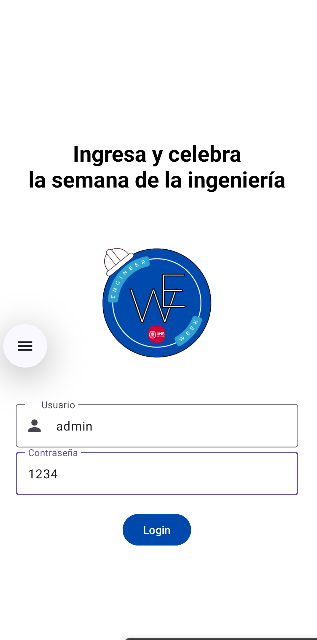
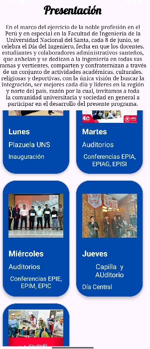
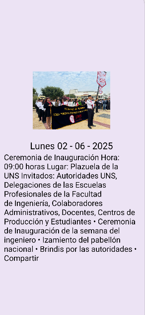
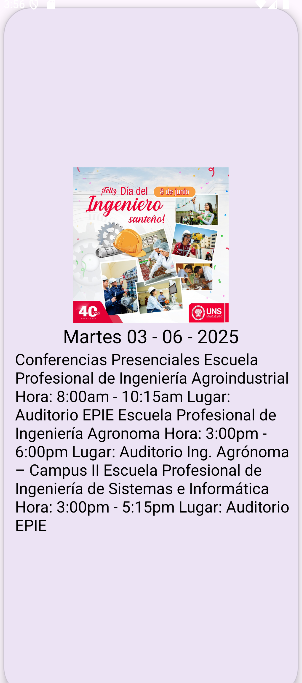
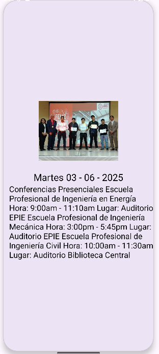

# 📅 Weekgineer

**Weekgineer** es una aplicación móvil desarrollada en Android para mostrar la programación y eventos de la Semana del Ingeniero en la Universidad Nacional del Santa (UNS). 
La app permite a los estudiantes ver las actividades día por día con imágenes, descripciones y ubicaciones.
---
## 🛠️ Tecnologías utilizadas

- 📱 **Kotlin**
- 🧩 **Android Studio**
- 🎨 **Material Design**
- 📂 **RecyclerView**
- 🗃️ **CardView**
- 🖼️ Recursos gráficos e íconos personalizados

---

## 📆 Funcionalidades

- Lista de eventos por día (Lunes a Viernes)
- Detalles de cada evento (fecha, lugar, imagen, descripción)
- Diseño visual atractivo y fácil de navegar
- Estructura pensada para ser fácilmente escalable

---

## 📸 Capturas de pantalla

- **Login simple**


-**Main que incluye cardViews con MaterialDesign3**


-**Pantalla con Detail de los CardView**





---

## 📦 Instalación

1. Clona el repositorio:

   ```bash
   git clone https://github.com/NiccoRoss/Weekgineer.git
